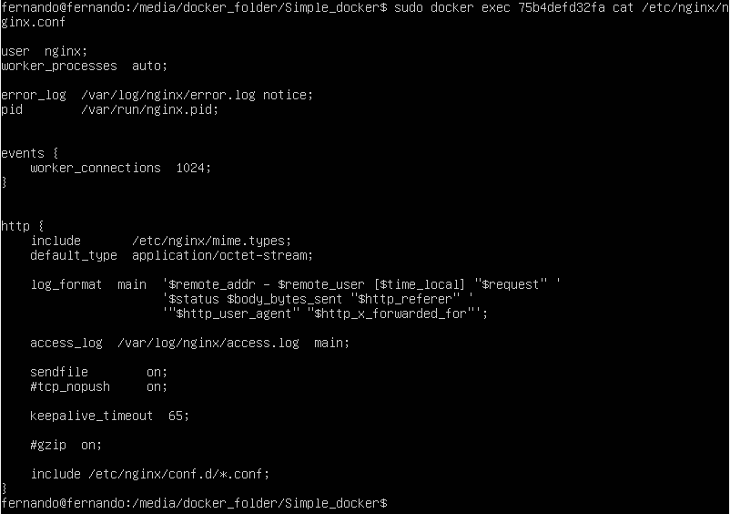
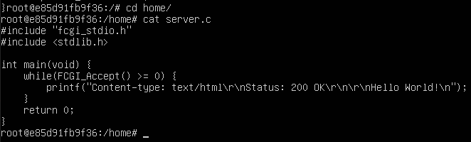
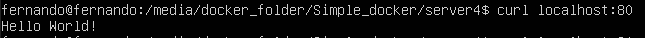

## Part 1. Готовый докер

*Установка Docker*

https://www.digitalocean.com/community/tutorials/how-to-install-and-use-docker-on-ubuntu-20-04

1.1 Использование команды docker pull для выкачки докера nginx


1.2 Проверка наличия докер образа при помощи команды docker images


1.3 Запуск докер образа при помощи команды docker run -d image_id


1.4 Проверка запуска докера при помощи команды docker ps


1.5 Просмотр информации о контейнере при помощи команды docker inspect container_id


1.6 Остановка докер образа и проверка, что он остановился


1.7 Запуск докера с замапленными портами 80 и 443


1.8 Проверка на доступность стартовой страницы nginx по адресу localhost:80 в браузере


1.9 Перезапуск докера и проверка, что он запустился


## Part 2. Операции с контейнером

2.1 Вывод содрежимого файла nginx.conf



2.2 Создание на локальной машине файла nginx.conf. Настройка в нем по пути /status отдачу страницы статуса сервера


2.3 Копирование файла nginx.conf внутрь докер образа. Перезапуск nginx внутри докер рбраза. Проверка статуса сервера


2.4 Экспорт контейнера в файл. Остановка контейнера


2.5 Удаление образа


2.6 Удаление остановленного контейнера


2.7 Импорт контейнера обратно. Запуск импортированного контейнера. Проверка работоспособности контейнера


## Part 3. Мини веб-сервер

3.1 Создание сервера на языке С


3.2 Создание nginx.conf


3.3 Выкачка докера nginx. Проверка, что загрузка прошла успешно. Запуск образа и проверка, что он запустился


3.4 Копирование nginx.conf и server.c в докер-контейнер


3.5 Вход в сам контейнер. Проверка, что файлы успешно скопировались




3.6 Обновление контейнера. Установка gcc, spawn-dcgi, libfcgi-dev

```bash
apt-get update
apt-get install -y gcc spawn-fcgi libfcgi-dev
```

3.7 Компиляция и запуск нашего сервера


3.8 Перезагрузка контейнера и проверка страницы в браузере


## Part 4. Свой докер

4.1 Создание докер образа.


4.2 Запуск скрипта из докера          


4.3 Сбор написанного образа. Маппинг 81 порта на 80. Проверка доступа стрички командной localhost:80   




4.4 Проверка на корректность сборки   


4.5 Добавление в файл nginx.conf проксирование странички /status      


4.6 Проверка странички /status               


## Part 5. **Dockle**

*Dockle installation*
*https://temofeev.ru/info/articles/dockle-diagnostika-bezopasnosti-konteynerov/*

```bash
#Ubuntu
VERSION=$(
 curl --silent "https://api.github.com/repos/goodwithtech/dockle/releases/latest" | \
 grep '"tag_name":' | \
 sed -E 's/.*"v([^"]+)".*/\1/' \
) && curl -L -o dockle.deb https://github.com/goodwithtech/dockle/releases/download/v${VERSION}/dockle_${VERSION}_Linux-64bit.deb
sudo dpkg -i dockle.deb && rm dockle.deb
```


5.1 Сканирование образа    

*Dockle не работает по ID, ему нужно имя репозитрия - ```olga_doc:new```*

```bash
dockle olga_doc:new
```


*Вспомогательный сайт для исправления ошибок*
*https://github.com/goodwithtech/dockle/blob/master/CHECKPOINT.md*

5.2 Проверка на отсутствие ошибок и предупреждений после исправления образа                    


## Part 6. Базовый **Docker Compose**

6.1 Файл docker-compose.yml       


*Собрать и запустить проект с помощью команд docker-compose build и docker-compose up*

```bash
docker-compose build
```


*Проверка образов и контейнеров*


6.2 Проверка на работоспособность после сборки и запуска
          
